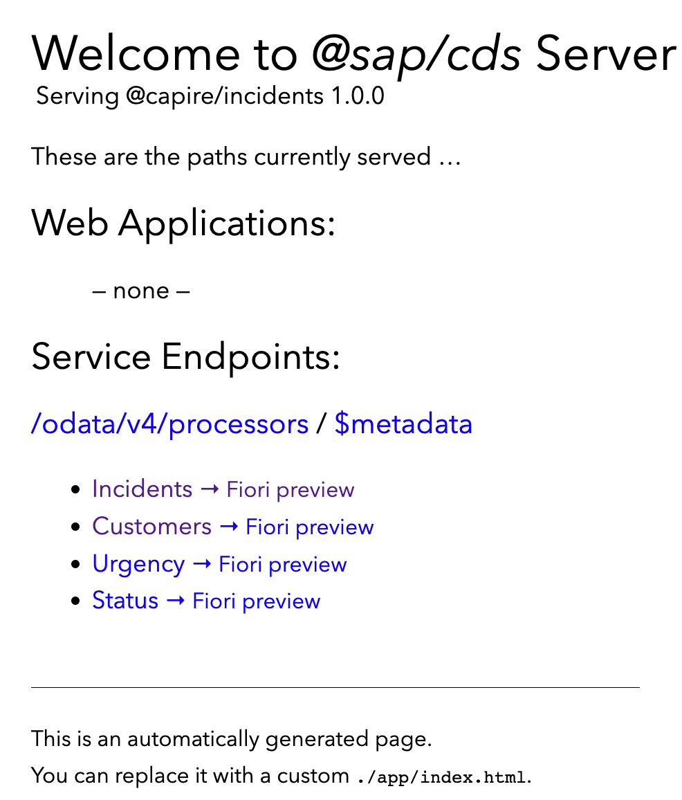
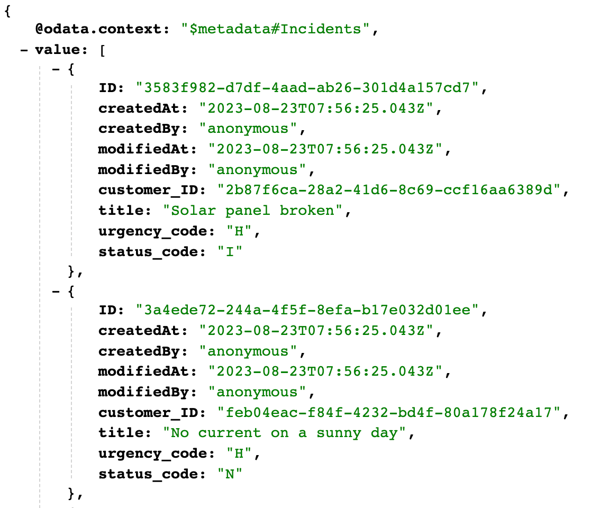
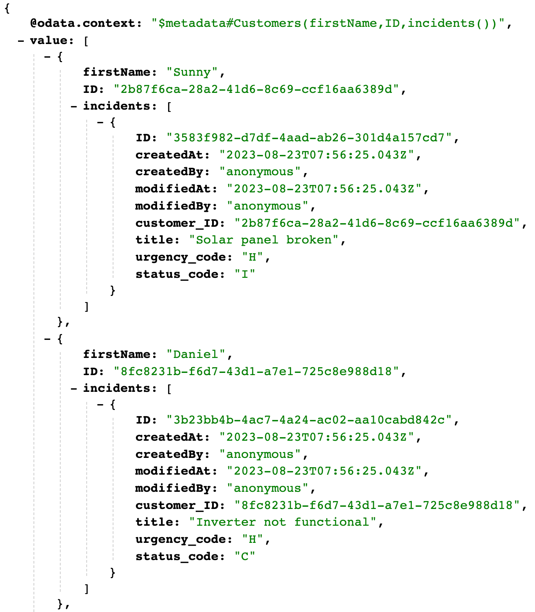

# Navigation

**Previous Steps**
[Set Up SAP Business Application Studio](01_Set_up_BAS.md).

[Table of Contents](Table_of_Contents.md).

[CAP Documentation](https://cap.cloud.sap/docs/).

**Next Steps:**
[Add Fiori Elements UIs](03_Add_Fiori_Elements_UIs.md).

# Create a CAP Project

1. In SAP Business Application Studio, click the burger menu at the top left corner and choose **Terminal** &rarr; **New Terminal**
2. Navigate to the projects folder from the root directory.

```bash
cd projects
```

3. Create a new project using `cds init`.

```bash
cds init incidents-mgmt
```

This creates a folder `incidents-mgmt` with your newly created CAP project.

4. Choose **Open Folder** &rarr; /home/user/projects. Choose **OK** to open the project in BAS.

> **_INFO:_** This document is compatible with cds version 7. Please go to the package.json file and check whether the @sap/cds version is 7 or higher. If necessary, update the cds version in the dependencies to: `@sap/cds: >=7`.

5. Choose **Terminal** &rarr; **New Terminal** from its menu.
6. You can now use the terminal to start the CAP server using following command:

> **_INFO:_** you need to be in the project, i.e. first navigate to your project in hte terminal via `cd ./projects/incidents-mgmt`.
 
```bash
cds watch
```

The CAP server serves all the CAP sources from your project. It also "watches" all the files in your projects and conveniently restarts whenever you save a file. Changes you've made are immediately served without you having to run the command again. In this newly created project the CAP server tells you that there are no models or service definitions yet that it can serve.
After you executed the `cds watch` command, you should get this feedback in the terminal:

```
[dev] cds w

cds serve all --with-mocks --in-memory?
live reload enabled for browsers

    ___________________________

 No models found in db/,srv/,app/,schema,services. // [!code focus]
 Waiting for some to arrive... // [!code focus]
```

You are invited to let this command run while doing the next steps to get immediate feedback from the CAP server. 
So, let's go on adding a CDS model as follows...
---

# Add a Domain Model

1. Create a new file `schema.cds` in the `db` folder of your project.
2. Paste the following code snippet in the `db/schema.cds` file.

```
using { User, cuid, managed, sap.common.CodeList } from '@sap/cds/common';
namespace sap.capire.incidents; 

/**
 * Incidents created by Customers.
 */
entity Incidents : cuid, managed {  
   customer     : Association to Customers;
   title        : String  @title : 'Title';
   urgency      : Association to Urgency;
   status       : Association to Status; 
   conversation  : Composition of many {
    key ID    : UUID;
    timestamp : type of managed:createdAt;
    author    : type of managed:createdBy;
    message   : String;
  };
}

/**
 * Customers entitled to create support Incidents.
 */
entity Customers : cuid, managed { 
  firstName     : String;
  lastName      : String;
  email         : EMailAddress;
  phone         : PhoneNumber;
  incidents     : Association to many Incidents on incidents.customer = $self;
}

entity Status : CodeList {
  key code: String enum {
      new = 'N';
      assigned = 'A'; 
      in_process = 'I'; 
      on_hold = 'H'; 
      resolved = 'R'; 
      closed = 'C'; 
  };
  criticality : Integer;
}

entity Urgency : CodeList {
  key code: String enum {
      high = 'H';
      medium = 'M'; 
      low = 'L'; 
  };
}

type EMailAddress : String;
type PhoneNumber : String;
```
As soon as you saved the file, the still running CAP server reacts immediately with a new output:

```
[cds] - connect to db > sqlite { database: ':memory:' }
/> successfully deployed to in-memory db.
```

This means that the CAP server detected the changes in `db/schema.cds` and automatically created an in-memory SQLite database when restarting the server process.

---
# Create services

After the recent changes, the CAP server prints this message:

```
No service definitions found in loaded models.
    Waiting for some to arrive...
```

Let's define a service _ProcessorsService_ for support engineers to process incidents created on behalf of customers.

to create the service definition:

1. Create a new file `processors-service.cds` in the `srv` folder.

> **_NOTE:_** The [CAP service documentation](https://cap.cloud.sap/docs/about/#service-definitions-in-cds) might clarify possible ambiguities

2. Paste the following code snippet in the `srv/processors-service.cds` file:

```
using { sap.capire.incidents as my } from '../db/schema';

service ProcessorsService { 
  entity Incidents as projection on my.Incidents;
  entity Customers as projection on my.Customers;
}
```

This time, the CAP server reacted with additional output:

```
[cds] - serving ProcessorsService { path: '/odata/v4/processors' } 

[cds] - server listening on { url: 'http://localhost:4004' }
[cds] - [ terminate with ^C ]
```

As you can see in the log output, the new file created generic service provider `ProcessorsService` that serve requests on the `/odata/v4/processors` endpoint.

`Command+click` to open the link `https://port4004-workspaces-ws-9pjlw.us10.applicationstudio.cloud.sap/launchpage.html#Shell-home` from SAP Business Application Studio in your browser, you'll see the generic index.html page:



> **_INFO:_** You may have to stop the CAP server with `Ctrl + c` and restart it with the `cds watch` command.

---

# Add Data to You Database

Since we already have an SQLite in-memory database that was automatically created earlier, let's now fill it with some test data.

## generate `.csv` Templates

1. Run the following command in the root folder of your project (incidents-mgmt):

```bash
cds add data
```
2. Check the output.

```
Adding feature(s) to project in current folder

Adding feature 'data'...
Creating db\data\sap.capire.incidents-Incidents.csv
Creating db\data\sap.capire.incidents-Customers.csv
Creating db\data\sap.capire.incidents-Conversations.csv
Creating db\data\sap.capire.incidents-Status.csv
Creating db\data\sap.capire.incidents-Urgency.csv
Creating db\data\sap.capire.incidents-Status.texts.csv
Creating db\data\sap.capire.incidents-Urgency.texts.csv
Done adding features
```

## Fill In Test Data

Replace the generated `.csv` templates with the following content:

- `db/data/sap.capire.incidents-Customers.csv`:

```
ID,firstName,lastName,email,phone
8fc8231b-f6d7-43d1-a7e1-725c8e988d18,Daniel,Watts,daniel.watts@demo.com,+44-555-123
feb04eac-f84f-4232-bd4f-80a178f24a17,Stormy,Weathers,stormy.weathers@demo.com,
2b87f6ca-28a2-41d6-8c69-ccf16aa6389d,Sunny,Sunshine,sunny.sunshine@demo.com,+01-555-789
```

- `db/data/sap.capire.incidents-Incidents.csv`:

```
ID,customer_ID,title,urgency_code,status_code
3b23bb4b-4ac7-4a24-ac02-aa10cabd842c,8fc8231b-f6d7-43d1-a7e1-725c8e988d18,Inverter not functional,H,C
3a4ede72-244a-4f5f-8efa-b17e032d01ee,feb04eac-f84f-4232-bd4f-80a178f24a17,No current on a sunny day,H,N
3ccf474c-3881-44b7-99fb-59a2a4668418,feb04eac-f84f-4232-bd4f-80a178f24a17,Strange noise when switching off Inverter,M,N
3583f982-d7df-4aad-ab26-301d4a157cd7,2b87f6ca-28a2-41d6-8c69-ccf16aa6389d,Solar panel broken,H,I
```
  
- `db/data/sap.capire.incidents-Incidents.conversation.csv`:

```
ID,up__ID,timestamp,author,message
2b23bb4b-4ac7-4a24-ac02-aa10cabd842c,3b23bb4b-4ac7-4a24-ac02-aa10cabd842c,1995-12-17T03:24:00Z,Harry John,Can you please check if battery connections are fine?
2b23bb4b-4ac7-4a24-ac02-aa10cabd843c,3a4ede72-244a-4f5f-8efa-b17e032d01ee,1995-12-18T04:24:00Z,Emily Elizabeth,Can you please check if there are any loose connections?
9583f982-d7df-4aad-ab26-301d4a157cd7,3583f982-d7df-4aad-ab26-301d4a157cd7,2022-09-04T12:00:00Z,Sunny Sunshine,Please check why the solar panel is broken
9583f982-d7df-4aad-ab26-301d4a158cd7,3ccf474c-3881-44b7-99fb-59a2a4668418,2022-09-04T13:00:00Z,Bradley Flowers,What exactly is wrong?
```

- `db/data/sap.capire.incidents-Status.csv`:

```
code;descr;criticality
N;New;3
A;Assigned;2
I;In Process;2
H;On Hold;3
R;Resolved;2
C;Closed;4
```
  
- `db/data/sap.capire.incidents-IUrgency.csv`:

```
code;descr
H;High
M;Medium
L;Low
```

> **_NOTE:_** The `cds add data` command added seven files, though we do not add data to the `.tests.csv` files because they hold translated text once the app is localized and translations are created.

Upon detecting these new files, the CAP server with an output telling us that the content of the files has been filled into the database automatically:

```
[cds] - connect to db > sqlite { database: ':memory:' }
  > init from db\data\sap.capire.incidents-Incidents.conversation.csv 
  > init from db\data\sap.capire.incidents-Customers.csv 
  > init from db\data\sap.capire.incidents-Incidents.csv 
  > init from db\data\sap.capire.incidents-Status.csv 
  > init from db\data\sap.capire.incidents-Status.texts.csv 
  > init from db\data\sap.capire.incidents-Urgency.csv 
  > init from db\data\sap.capire.incidents-Urgency.texts.csv 
/> successfully deployed to in-memory database.
```

Now that we've a database filled with some initial data, we can send complex OData queries served by the built-in generic service providers. In order to view the results of these queries, append the paths given below to the URL `https://port4004-workspaces-ws-9pjlw.us10.applicationstudio.cloud.sap/launchpage.html#Shell-home`, which can be opened by doing a Command+Click, and search.

- /odata/v4/processors/Incidents



  
- /odata/v4/processors/Customers?$select=firstName&$expand=incidents

---

# Adding Calculated Elements

Modify and add the following in `srv/processors-service.cds`:

```
service ProcessorsService {
  ...
}
extend projection ProcessorsService.Customers with { //[!code focus]
  firstName || ' ' || lastName as name: String
}
```

---

# Next Steps

After you have created your CAP application, you can start working on its user interface.

**Previous Steps**
[Set Up SAP Business Application Studio](01_Set_up_BAS.md).

[Table of Contents](Table_of_Contents.md)

**Next Steps:**
[Add Fiori Elements UIs](03_Add_Fiori_Elements_UIs.md)


