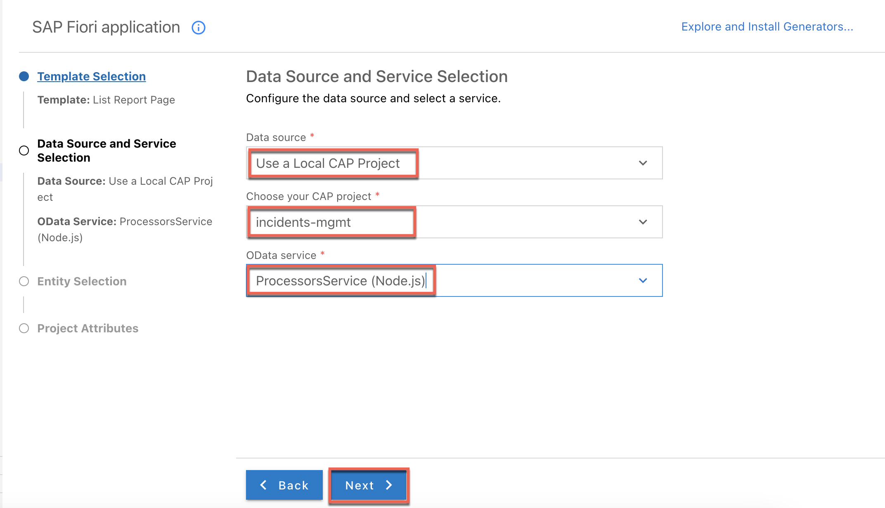
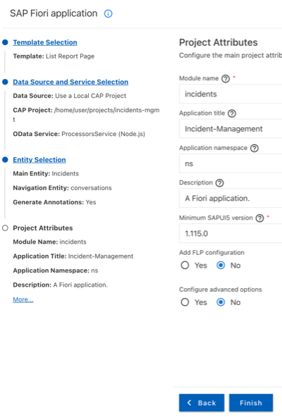
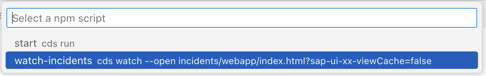
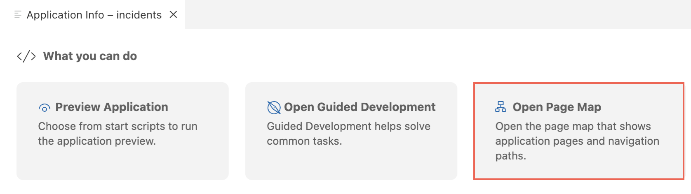
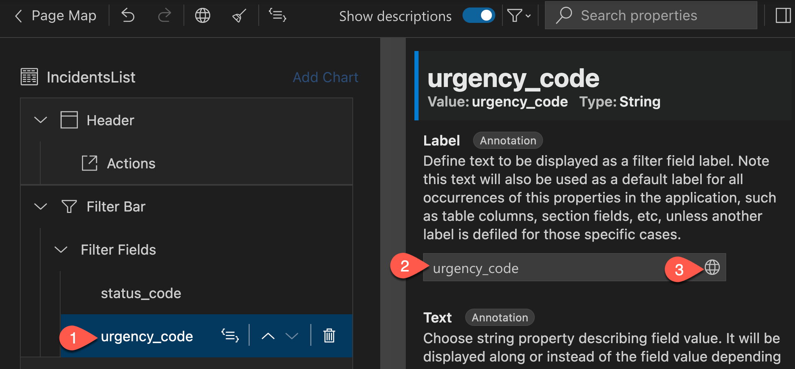
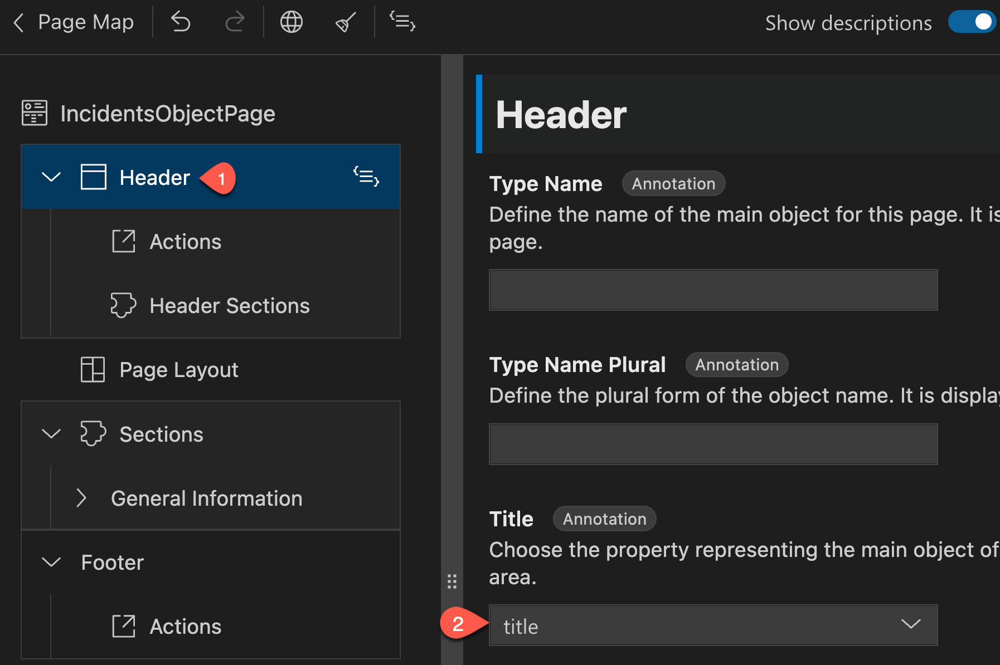
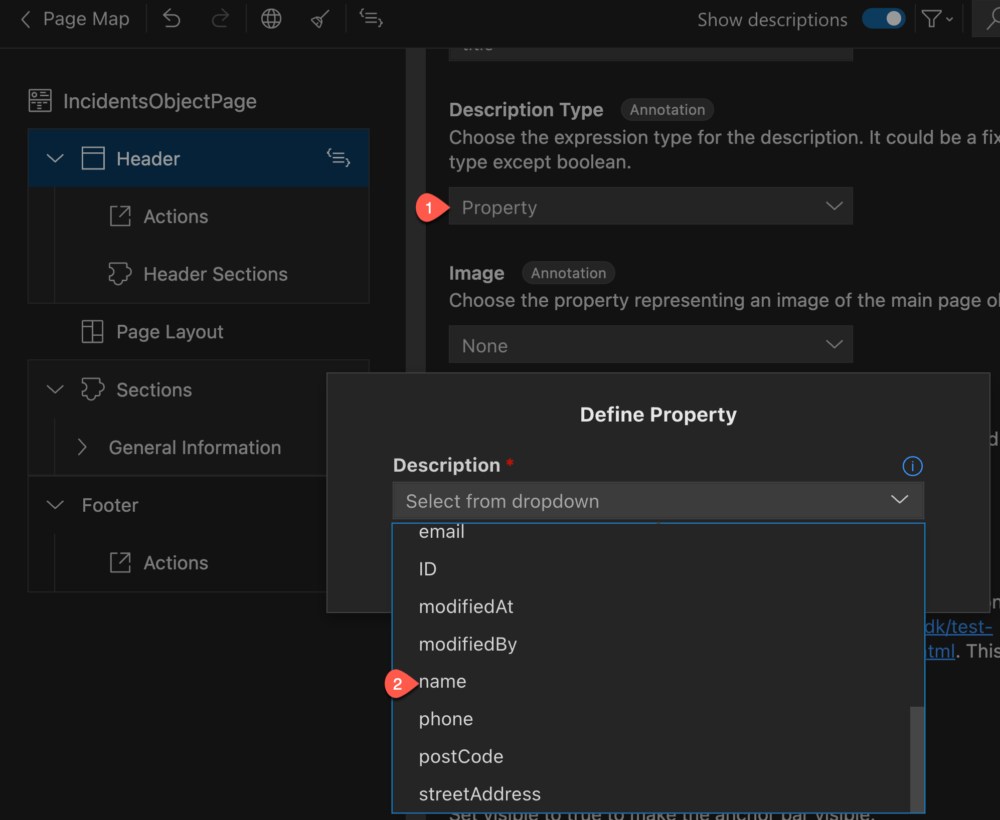
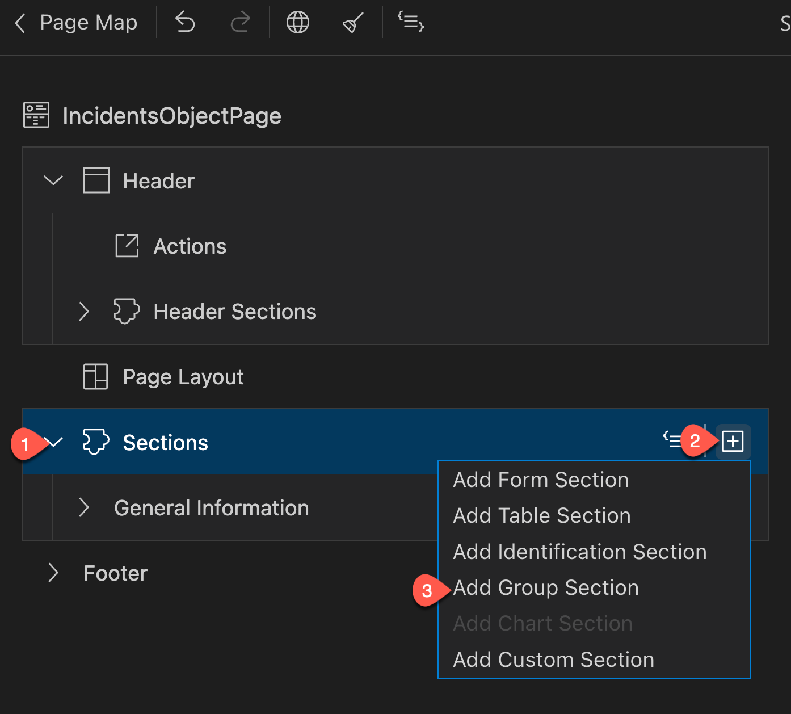
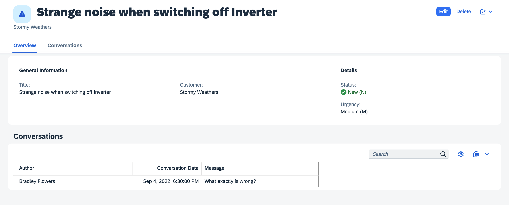

# Navigation

**Previous Steps**
[Build a CAP Application](02_Build_a_CAP_Application.md).

[Table of Contents](Table_of_Contents.md).

[CAP Documentation](https://cap.cloud.sap/docs/).

**Next Steps:**
[Add Custom Logic](04_Add_Custom_Logic.md).

# Overview

SAP Fiori elements provides designs for UI patterns and predefined floorplans for common 
application use cases. App developers can use SAP Fiori elements to create SAP Fiori 
applications based on OData services and annotations that don't need JavaScript UI coding. 
The resulting app uses predefined views and controllers that are provided centrally. 
This means no application-specific view instances are required. SAPUI5 interprets metadata 
and annotations of the underlying OData service and uses the corresponding views for the SAP Fiori app at startup.

# Generate the UI with an SAP Fiori Elements Template

1. In SAP Business Application Studio, invoke the Command Palette
(**View** &rarr; **Command Palette** or `Shift + Command + P` for macOS / `Ctrl + Shift + P for Windows`) and choose **Fiori: Open Application Generator**.

2. Choose Template Type **SAP Fiori** and template **List Report Page**.


3. Choose **Next**.

4. In the next dialog, choose **Use a Local CAP Project** as your Data Source and choose your current `incidents-mgmt` project as the CAP project.

> **_NOTE:_** In case you get following error: `Node module @sap/cds isn't found. Please install it and try again`, you have to install the CAP module which is also required by the app generator.
> Please open the terminal and run the following command: ```npm install --global @sap/cds-dk --@sap:registry=https://registry.npmjs.org/```

5. The Data source has to be `Use a Local CAP Project`, for Choose your CAP project, fill in `incidents-mgmt`. Select `ProcessorsService(Node.js)` as OData service and choose **Next**.



6. Select **Incidents** as the main entity, **conversations** as the navigation entity, and choose the option **Yes** to add table columns automatically. Choose **Next**.


7. Enter `incidents` as the module name and `Incident-Management` as the application title.

8. Enter `ns` as the namespace.

9. Leave the default values for all other settings and choose **Finish**.



The application is now generated and in a few seconds you can see it in the `app` folder of your project. 
It contains an `incidents` folder and a `webapp` folder with a `Component.js` file that is characteristic for an SAPUI5 app.

# Modify the UI with the SAP Fiori tools Application Modeler

## Starting the App

Instead of using `cds watch` in the terminal in order to start the service, we will use the watch script that has been added by the app generator 
to the `package.json` file in the root folder. The script contains additional parameter `sap-ui-xx-viewCache=false` added to the app start URL. 
This parameter ensures that in case custom extensions should be implemented, changes to the extension artifacts get properly updated when refreshing the UI.

If `cds watch` is already running in a terminal, please end it by pressing keyboard keys `Ctrl + C`, otherwise the default port 4004 will already be in use by the existing server process.

1. Choose **Preview Application** under the **Application Info - incidents** tab that is automatically displayed after app generartion.

> **_INFO:_** If the tab is closed, you can reopen it by invoking the Command Palette (**View** &rarr; **Comand Palette** or `Shift + Command + P` for macOS / `Ctrl + Shift + P` for Windows) and choosing
> **Fiori: Open Application Info**

This opens a dropdown at hte top offering all `cds run` and `cds watch`-based scripts maintained in the scrips selection of the `package.json` file.

2. Choose npm script **watch-incidents**.



This runs the service in an application modeler terminal session and automatically starts the SAP Fiori application in a new browser session.

3. You can now see the application with the generated columns. Choose **Go**.


## Configure the List Report Page

1. Choose **Open Page Map** under **Application Info - Incidents** tab.



You will see the properties on the right side of the page map. You can edit these to update the UI of the application.

2. Choose the pencil icon in the page map next to the title to start configuring the **List Report** page.


3. Select **Filter Fields** under **Filter Bar** and click on the icon to add filter fields.


4. In the droppdown, select `status_code`, `urgency_code`, and choose **Add**. Your application will update and show the new filters.


This defines which of the properties are exposed as search fields in the header bar above the list.

5. Select hte filter `urgency_code` and update the value of the **Label** field on the right to `Urgency`.

6. Press `Enter` to confirm.

> **_NOTE:_** The filter labels are text strings. It's a good idea to update them so they are internationalisation (i18n) compliant.

7. Choose the globe icon to generate a translatable text key. When prompted to confirm the generation, press **Apply**.



8. Repeat steps 5-7 above to also update the label of the filter `status_code` to `Status`.

9. Update the value of the **Display Type** field to `Value Help` for both the `urgency` and `Status` filters.
In the popup, select `descr` as the `Value Description Property` and press **Apply**.

10. Navigate to **Table** &rarr; **Columns** and select **urgency_code**. In the right pane, set **Text** to **urgency/descr** and **Text Arrangement** to **Text Only**,
    so that the user could see the human readable text instead of the urgency code.

12. Select **status_code** under **Columns**. In the right pane, set **Text** to **status/descr** and **Text Arrangement** to **Text Only**,
    so that the user could see the human readable text instead of the status code.
    
13. Navigate to `Customer` and select `name`. Click `Add` to add columns.

> **_TIPP:_** To easily find this field, type the first few characters of `Customer`, followed by a `/` and a few characters of `name`, such as: `cus/n`.

14. The `name` column is added as the last column, make it the second column: select it, click on the `^` button to move the column up or just
15. drag it up and drop at the second position. Similarly, move `Urgency` column to the last position.

16. The column labels are text strings, update them and make them internationalisation (i18n) compliant as you did for filters in steps 5-7:

Generated text key | Updated text key
 ---|---
name | Customer
Description (urgency/descr) | Urgency
Description (status/descr) | Status

16. Choose **Table** and set the value of **Initial Load** field on the right to **Enabled** to load data automatically.


17. Set the value of **Type** field to **ResponsiveTable** to make the table responsive.

18. Choose **Table** &rarr; **Columns** &rarr; **Status** and set the value of **Criticality** field on the right to **status/criticality**.


19. The list page of the incident app should look like this below.


20. Navigate back to the page editor and choose **Page Map** in the top left corner. This takes you back to the overview of the incident app.

## Configure the Object Page

1. In the page map, choose the pencil icon next to the `Object Page IncidentsObjectPage` title to start configuring the object page.

2. Choose `Header` and set the value of the **Title** field on the right to **title**.



3. Set the value of the **Description Type** field to **Property**. A popup opens.

4. From the drop down, select **name** under **Customer** and choose **Apply**.



5. Set the value of the **Icon URL** field to `sap-icon://alert`.

6. Navigate to `Sections` &rarr; `General Informations` &rarr; `Form` &rarr; `Fields` and delete `urgency_code` and `status_code`.

7. Navigate to `Sections`, click on the icon to add sections and choose `Add Group Section` from hte dropdown. Enter `Overview` as the Label and internationalize it by clicking on hte globe icon.
   Then,click on `Add`.



8. Navigate to `Subsections` from `Overview` section, click on the icon to add sections and choose `Add Form Section` from the dropdown. 
Enter `Details` as the Label and internationalize it by clicking on the globe icon. Then, click on `Add`.

9. Navigate to `Form` &rarr; `Fields` and choose Add Basic Fields.


10. Select `status_code` and `urgency_code` from the drop down. Choose `Add` to add the fields to the form.

11. Change the labels of `status_code` to `Status` and `urgency_code` to `Urgency` respectively. Also, internationilize it by selecting the `globe` icon.

12. Now for the `Status` field, choose `Display Type` as `Value Help` on the right pane of page map. Select `Status` as `Value Source Entity`, `code` as `Value Source Property` and `descr` as `Value Description Property`. Do the same for `Urgency` field as well. Choose `Text` as `status/descr` and `urgency/descr` respectively in the right pane.

13. Set the value in the `Text` field to match that in the value help by clicking the `Take over text` button next to the field.

14. Navigate to `Sections` &rarr; `General` Information and generate a translatable text key by choosing the `Globe` icon in the Label field for General Information.

15. Navigate to `Sections` &rarr; `General Information` &rarr; `Form` &rarr; `Fields` choose the `+` sign to add more fields and choose `Add Basic Fields`.
 
16. From the popup of `Add Basic Fields`, select `Customer_ID` from the dropdown and choose `Add`.

17. Navigate to `Sections` &rarr; `General Information` &rarr; `Form` &rarr; `Fields` and change the Label value of `customer_ID` to `Customer`. Generate a translatable text by clicking on the `Globe` icon.

18. For the same `Customer` field, navigate to the `Text` dropdown and choose `customer/name`. Similarly choose `Text Only`, from the `Text Arrangement` dropdown. Then click on `Edit properties for Value Help` under `Display Type` and toggle off `Display as a dropdown`. Click `Apply`.

19. Navigate to `Sections` and drag `General Information` into `Overview` &rarr; `Subsections`.

20. Navigate to `Sections`, click on the icon to add sections and choose `Add Table Section`.

21. Enter `Conversation` in the `Label` field, choose `conversation` from the `Value Source` drop down and press `Add`.


22. Navigate to `Conversation` &rarr; `Table` &rarr; `Columns`, click on the icon to add columns, and choose `Add Basic Columns` from the dropdown.

23. Select `timestamp`, `author`, `message` and press `Add`.

24. Choose the `timestamp` column, change the value in the `Label` field to `Conversation Date`.

25. Update the labels for the columns `author` and `message`. Internationalize all labels that are not yet prepared for translation by clicking on the globe icon on the top of the screen.
    Press `Apply` in the pop-up to confirm the generation of text keys.

27. Choose `Table` and set the value of the `Type` field on the right pane to `ResponsiveTable` to make the table responsive.

28. Set `Creation Mode : Name` on the right pane to `Inline`.

29. The complete list object page looks like below



## Draft-Based Editing

SAP Fiori supports editing business entities with draft states stored on the server, so users can interrupt editing and continue later on, possibly from different places and devices. CAP, as well as SAP Fiori elements, provide out-of-the-box support for drafts. We recommend to always use draft when your SAP Fiori application needs data input by end users.

## Enabling Draft with `@odata.draft.enabled`

Open the file `proccessors-service.cds` which is in the `./srv` folder.

Enabling draft for an entity allows the users to edit the entities. To enable draft for an entity exposed by a service, simply annotate it with `@odata.draft.enabled` as in this example:

```
service ProcessorsService { 
  ...
}
...
annotate ProcessorsService.Incidents with @odata.draft.enabled; //[!code focus]
```

# Navigation

**Previous Steps**
[Build a CAP Application](02_Build_a_CAP_Application.md).

[Table of Contents](Table_of_Contents.md)

**Next Steps:**
[Add Custom Logic](04_Add_Custom_Logic.md)
