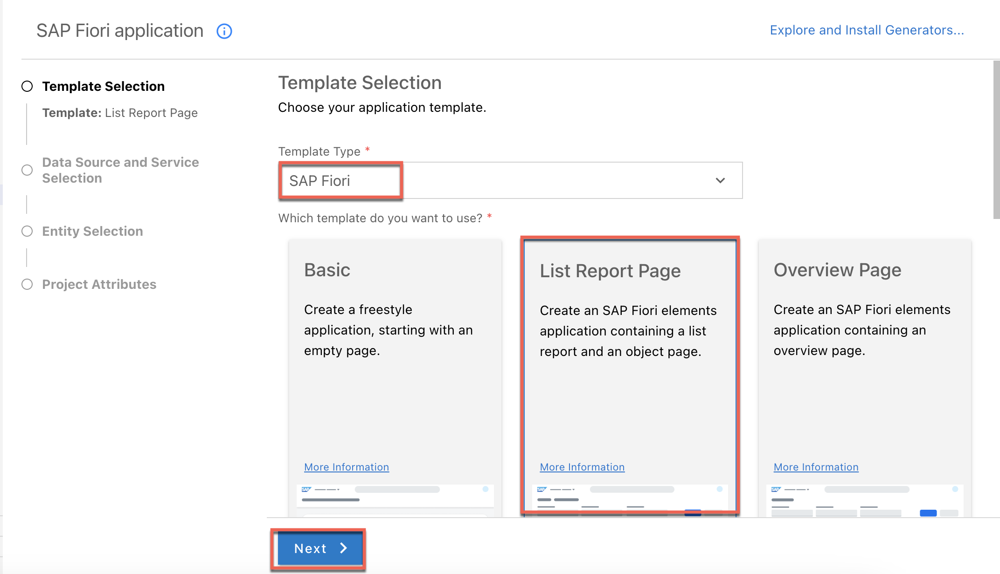

# Prerequisites

You have built your CAP application. See [Build a CAP application](Build_a_CAP_Application.md).

# Overview

SAP Fiori elements provides designs for UI patterns and predefined floorplans for common 
application use cases. App developers can use SAP Fiori elements to create SAP Fiori 
applications based on OData services and annotations that don't need JavaScript UI coding. 
The resulting app uses predefined views and controllers that are provided centrally. 
This means no application-specific view instances are required. SAPUI5 interprets metadata 
and annotations of the underlying OData service and uses the corresponding views for the SAP Fiori app at startup.

# Generate the UI with an SAP Fiori Elements Template

1. In SAP Business Application Studio, invoke the Command Palette
(**View** &rarr; **Command Palette** or `Shift + Command + P` for macOS / `Ctrl + Shift + P for Windows`) and choose **Fiori: Open Application Generator**.

2. Choose Template Type **SAP Fiori** and template **List Report Page**.



3. Choose **Next**.

4. In the next dialog, choose **Use a Local CAP Project** as your Data Source and choose your current `incidents-mgmt` project as the CAP project.

> **_NOTE:_** In case you get following error: `Node module @sap/cds isn't found. Please install it and try again`, you have to install the CAP module which is also required by the app generator.
> Please open the terminal and run the following command: ```npm install --global @sap/cds-dk --@sap:registry=https://registry.npmjs.org/```

5. The Data source has to be `Use a Local CAP Project`, for Choose your CAP project, fill in `incidents-mgmt`. Select `ProcessorsService(Node.js)` as OData service and choose **Next**.


6. Select **Incidents** as the main entity, **conversations** as the navigation entity, and choose the option **Yes** to add table columns automatically. Choose **Next**.


7. Enter `incidents` as the module name and `Incident-Management` as the application title.

8. Enter `ns` as the namespace.

9. Leave the default values for all other settings and choose **Finish**.


