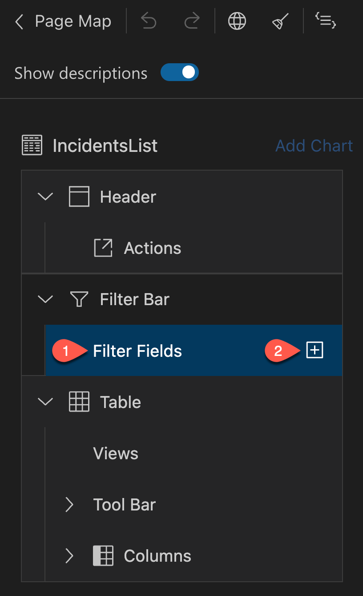

# Prerequisites

You have built your CAP application. See [Build a CAP application](Build_a_CAP_Application.md).

# Overview

SAP Fiori elements provides designs for UI patterns and predefined floorplans for common 
application use cases. App developers can use SAP Fiori elements to create SAP Fiori 
applications based on OData services and annotations that don't need JavaScript UI coding. 
The resulting app uses predefined views and controllers that are provided centrally. 
This means no application-specific view instances are required. SAPUI5 interprets metadata 
and annotations of the underlying OData service and uses the corresponding views for the SAP Fiori app at startup.

# Generate the UI with an SAP Fiori Elements Template

1. In SAP Business Application Studio, invoke the Command Palette
(**View** &rarr; **Command Palette** or `Shift + Command + P` for macOS / `Ctrl + Shift + P for Windows`) and choose **Fiori: Open Application Generator**.

2. Choose Template Type **SAP Fiori** and template **List Report Page**.


3. Choose **Next**.

4. In the next dialog, choose **Use a Local CAP Project** as your Data Source and choose your current `incidents-mgmt` project as the CAP project.

> **_NOTE:_** In case you get following error: `Node module @sap/cds isn't found. Please install it and try again`, you have to install the CAP module which is also required by the app generator.
> Please open the terminal and run the following command: ```npm install --global @sap/cds-dk --@sap:registry=https://registry.npmjs.org/```

5. The Data source has to be `Use a Local CAP Project`, for Choose your CAP project, fill in `incidents-mgmt`. Select `ProcessorsService(Node.js)` as OData service and choose **Next**.


6. Select **Incidents** as the main entity, **conversations** as the navigation entity, and choose the option **Yes** to add table columns automatically. Choose **Next**.


7. Enter `incidents` as the module name and `Incident-Management` as the application title.

8. Enter `ns` as the namespace.

9. Leave the default values for all other settings and choose **Finish**.


The application is now generated and in a few seconds you can see it in the `app` folder of your project. 
It contains an `incidents` folder and a `webapp` folder with a `Component.js` file that is characteristic for an SAPUI5 app.

# Modify the UI with the SAP Fiori tools Application Modeler

## Starting the App

Instead of using `cds watch` in the terminal in order to start the service, we will use the watch script that has been added by the app generator 
to the `package.json` file in the root folder. The script contains additional parameter `sap-ui-xx-viewCache=false` added to the app start URL. 
This parameter ensures that in case custom extensions should be implemented, changes to the extension artifacts get properly updated when refreshing the UI.

If `cds watch` is already running in a terminal, please end it by pressing keyboard keys `Ctrl + C`, otherwise the default port 4004 will already be in use by the existing server process.

1. Choose **Preview Application** under the **Application Info - incidents** tab that is automatically displayed after app generartion.

> **_INFO:_** If the tab is closed, you can reopen it by invoking the Command Palette (**View** &rarr; **Comand Palette** or `Shift + Command + P` for macOS / `Ctrl + Shift + P` for Windows) and choosing
> **Fiori: Open Application Info**

This opens a dropdown at hte top offering all `cds run` and `cds watch`-based scripts maintained in the scrips selection of the `package.json` file.

2. Choose npm script **watch-incidents**.


This runs the service in an application modeler terminal session and automatically starts the SAP Fiori application in a new browser session.

3. You can now see the application with the generated columns. Choose **Go**.


## Configure the List Report Page

1. Choose **Open Page Map** under **Application Info - Incidents** tab.


You will see the properties on the right side of the page map. You can edit these to update the UI of the application.

2. Choose the pencil icon in the page map next to the title to start configuring the **List Report** page.


3. Select **Filter Fields** under **Filter Bar** and click on the icon to add filter fields.



4. In the droppdown, select `status_code`, `urgency_code`, and choose **Add**. Your application will update and show the new filters.


This defines which of the properties are exposed as search fields in the header bar above the list.

5. Select hte filter `urgency_code` and update the value of the **Label** field on the right to `Urgency`.

6. Press `Enter` to confirm.

> **_NOTE:_** The filter labels are text strings. It's a good idea to update them so they are internationalisation (i18n) compliant.

7. Choose the globe icon to generate a translatable text key. When prompted to confirm the generation, press **Apply**.


8. Repeat steps 5-7 above to also update the label of the filter `status_code` to `Status`.


